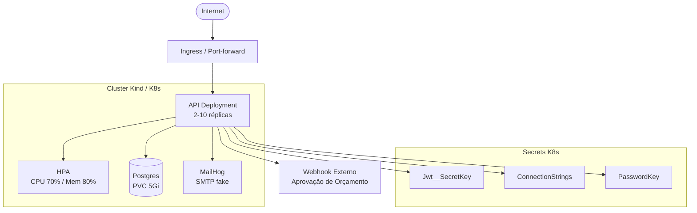

# Oficina Mecânica — API

API REST desenvolvida em **ASP.NET Core (.NET 10)** como Tech Challenge da pós-graduação FIAP SOAT.  
Gerencia o ciclo completo de uma oficina mecânica: clientes, veículos, serviços, peças, ordens de serviço e autenticação por perfil.

---

## Índice

- [Descrição e objetivos da Fase 2](#descrição-e-objetivos-da-fase-2)
- [Arquitetura](#arquitetura)
- [Como executar](#como-executar)
- [CI/CD — Fluxo de deploy](#cicd--fluxo-de-deploy)
- [Collection das APIs](#collection-das-apis)
- [Vídeo demonstrativo](#vídeo-demonstrativo)
- [Documentação interativa (Scalar)](#documentação-interativa-scalar)
- [Autenticação](#autenticação)
- [Roteiros de teste](#roteiros-de-teste)
- [Cobertura de testes](#cobertura-de-testes)
- [Relatório de vulnerabilidades](#relatório-de-vulnerabilidades)

---

## Descrição e objetivos da Fase 2

Esta fase evolui a API REST de gerenciamento de oficina mecânica para um ambiente **Kubernetes local** provisionado via **Terraform (IaC)**:

- **Deploy em Kubernetes** com cluster Kind, 2 réplicas da API, HPA (escalonamento automático por CPU/memória), volume persistente para PostgreSQL e MailHog para e-mails transacionais.
- **Infraestrutura como código** com Terraform: cluster, manifestos e metrics-server provisionados com um único `make oficina-up`.
- **CI/CD** com GitHub Actions: pipeline de build, testes, push de imagem para GHCR e deploy automatizado em push para `main`.
- **Escalabilidade automática** demonstrada: HPA escala de 2 a 10 réplicas sob carga, retorna ao mínimo após estabilização.

> Detalhamento completo da infraestrutura: [`docs/infra-detalhado.md`](./docs/infra-detalhado.md)

---

## Arquitetura

O projeto segue **Clean Architecture** com quatro camadas e regra de dependência estrita (dependências só apontam para dentro):

```
API  →  Application  →  Domain
 ↓           ↓
Infrastructure
```

### Desenho da infraestrutura (Fase 2)



### Fluxo de deploy

```
Desenvolvedor
    │
    ├─ make oficina-up
    │       │
    │       ├─ docker build → oficina-mecanica-api:local
    │       │
    │       └─ terraform apply
    │               │
    │               ├─ kind create cluster (1 control-plane + 1 worker)
    │               ├─ kind load docker-image
    │               ├─ kubectl apply: secret, configmap, postgres-pvc
    │               ├─ kubectl apply: postgres-deployment + service
    │               ├─ kubectl apply: mailhog-deployment
    │               ├─ kubectl apply: api-deployment + service + hpa
    │               └─ kubectl apply: metrics-server
    │
    └─ port-forward svc/oficina-mecanica-api 5000:80
       port-forward svc/mailhog 8025:8025
```

### Camadas

| Camada | Projeto | Responsabilidade |
|---|---|---|
| **Domain** | `OficinaMecanica.Domain` | Entidades, Value Objects, Domain Events, interfaces de repositório |
| **Application** | `OficinaMecanica.Application` | Use Cases, DTOs, interfaces de infraestrutura, Result\<T\> pattern |
| **Infrastructure** | `OficinaMecanica.Infrastructure` | Repositórios EF Core, JWT, Argon2, logging, e-mail, dispatch de eventos |
| **API** | `OficinaMecanica.API` | Controllers, DI composition root, configuração |

### Estrutura de Application

```
Application/
├── Common/
│   └── Result.cs               # Result<T> — use cases não lançam exceções de negócio
├── Configuration/
│   └── IJwtSettings.cs         # Abstração de config (sem dependência de IConfiguration)
├── DTOs/
│   ├── Requests/               # Request Models (entrada dos use cases)
│   └── Responses/              # Response Models (saída dos use cases)
├── Interfaces/
│   ├── ITokenGenerator.cs      # Abstração de JWT (impl. em Infrastructure)
│   ├── IPasswordHasher.cs      # Abstração de Argon2 (impl. em Infrastructure)
│   └── IAppLogger.cs           # Abstração de logging (impl. em Infrastructure)
├── Mappers/
│   └── OrdemServicoMapper.cs   # Mapeamento entidade → DTO
└── UseCases/                   # 49 use cases, um por operação
    ├── Auth/
    ├── Cliente/
    ├── OrdemServico/
    ├── OrdemServicoStatus/
    ├── Peca/
    ├── Servico/
    └── Veiculo/
```

### Value Objects (Domain)

| VO | Regra |
|---|---|
| `Email` | Validado via `MailAddress.TryCreate`; armazenado em lowercase |
| `Documento` | CPF (11 dígitos) ou CNPJ numérico/alfanumérico Mercosul (14 chars) com dígitos verificadores |
| `Telefone` | 10–13 dígitos após limpeza |
| `Placa` | Formato antigo `AAA9999` ou Mercosul `AAA9A99` |

### Domain Events

Disparados pelas entidades e publicados automaticamente pelo `ApplicationDbContext.SaveChangesAsync`:
`OrcamentoEnviadoEvent` · `OrdemAprovadaEvent` · `OrdemRejeitadaEvent` · `OrdemConcluidaEvent` · `OrdemEntregueEvent`

> Decisões arquiteturais detalhadas em [`docs/adr/`](./docs/adr/).

---

## Pré-requisitos

| Ferramenta | Versão mínima |
|---|---|
| .NET SDK | 10.0 |
| Docker | 24+ |
| Docker Compose | 2.x |
| kubectl | 1.28+ (para K8s) |
| Kind | 0.20+ (para K8s local) |
| Terraform | 1.6+ (para IaC) |

---

## Como executar

### Opção 1 — Kubernetes + Terraform (Fase 2) ✅ recomendado

Requer: Docker Desktop, Kind, Terraform, kubectl e make.

```bash
make setup       # verifica pré-requisitos e gera credenciais de dev
make oficina-up  # build + terraform apply + port-forwards
```

- API: <http://localhost:5000/scalar>
- MailHog: <http://localhost:8025>

Para encerrar: `make oficina-down`  
Para reiniciar limpo: `make oficina-reset`

> Guia completo com troubleshooting: [`docs/testing/00-infra.md`](./docs/testing/00-infra.md)  
> Detalhamento técnico da infraestrutura: [`docs/infra-detalhado.md`](./docs/infra-detalhado.md)

---

### Opção 2 — Docker Compose (execução local simples)

```bash
docker compose up -d --build
```

API em `http://localhost:5000`, MailHog em `http://localhost:8025`.

---

## CI/CD — Fluxo de deploy

O pipeline GitHub Actions (`.github/workflows/ci.yml`) cobre build, testes e deploy automático a cada push em `main`. A imagem é publicada no GitHub Container Registry (GHCR) e o cluster Kind é provisionado no runner para smoke test de deploy.

O pipeline está em `.github/workflows/ci.yml` e possui jobs separados por trigger:

### Em Pull Request (apenas testes)

```
build-and-test → dotnet restore + build + test
```

### Em push para main (build + deploy completo)

```
build-and-test → build-docker → deploy-banco → deploy-api
```

| Job | O que faz |
|---|---|
| `build-and-test` | Restore, build e testes automatizados |
| `build-docker` | Build e push da imagem para o GitHub Container Registry (GHCR) |
| `deploy-banco` | Sobe cluster Kind, aplica manifestos do Postgres |
| `deploy-api` | Aplica ConfigMap, Secret e manifestos da API; faz smoke test |

A imagem é publicada em:
```
ghcr.io/<seu-usuario>/oficina-mecanica-api:latest
ghcr.io/<seu-usuario>/oficina-mecanica-api:sha-<commit>
```

---

## Documentação interativa (Scalar)

Com a API no ar, acesse:

```
http://localhost:5000/scalar
```

Todas as rotas estão documentadas com descrição, parâmetros, exemplos de resposta e os perfis de acesso exigidos.

### Postman Collection

Importe a collection completa no Postman para testar todos os endpoints com variáveis de ambiente pré-configuradas:

- **Arquivo:** [`docs/oficina-mecanica.postman_collection.json`](docs/oficina-mecanica.postman_collection.json)

**Como importar:**
1. Abra o Postman → clique em **Import**
2. Selecione o arquivo acima
3. Configure a variável `baseUrl` se necessário (padrão: `http://localhost:5000`)
4. Faça **Auth → Login** primeiro — o token é salvo automaticamente nas variáveis da collection

---

## Collection das APIs

- **Scalar (interativa):** <http://localhost:5000/scalar> (com a API no ar)
- **Postman Collection:** [`docs/oficina-mecanica.postman_collection.json`](./docs/oficina-mecanica.postman_collection.json)

---

## Vídeo demonstrativo

> **[link do vídeo — a adicionar]**

O vídeo demonstra:
- Deploy da aplicação via `make oficina-up`
- Execução do pipeline CI/CD
- Consumo das APIs via Scalar / Postman
- Escalabilidade automática (HPA sob carga)

---

## Autenticação

A API usa **JWT Bearer Token**. O token é obtido via login e deve ser enviado no header de todas as rotas protegidas.

### Endpoint de login

```http
POST /Auth/login
Content-Type: application/json

{
  "email": "admin@oficina.com",
  "senha": "Senha@123"
}
```

Resposta:
```json
{
  "token": "eyJhbGciOiJIUzI1NiIsInR5cCI6IkpXVCJ9...",
  "expiracao": "2026-01-01T12:05:00Z"
}
```

Inclua o token em todas as requisições:
```
Authorization: Bearer {token}
```

> O token expira em **5 minutos**. Faça um novo login para renová-lo.

### Perfis de acesso

| Perfil | Valor | Acesso |
|---|---|---|
| `Admin` | `0` | Todas as rotas administrativas |
| `Mecanico` | `1` | Iniciar diagnóstico e notificar conclusão de OS |
| `Cliente` | `2` | Aprovar/rejeitar orçamento e consultar status da OS |

### Rotas públicas (sem token)

| Método | Rota | Descrição |
|---|---|---|
| `POST` | `/Auth/login` | Obter token JWT |
| `POST` | `/Auth/registrar` | Registrar usuário |
| `GET` | `/Publico/os/{id}/status` | Consultar status de uma OS sem autenticação |

### Rotas protegidas

Todas as demais rotas exigem `Authorization: Bearer {token}` com o perfil indicado:

| Recurso | Perfil exigido |
|---|---|
| Clientes, Veículos, Serviços, Peças | `Admin` |
| Ordens de serviço (CRUD e itens) | `Admin` |
| Iniciar diagnóstico / Notificar conclusão | `Admin` ou `Mecanico` |
| Aprovar / Rejeitar orçamento | `Admin` ou `Cliente` |
| Registrar entrega / Forçar status | `Admin` |
| Histórico de status | `Admin`, `Mecanico` ou `Cliente` |

---

## Roteiros de teste

Guias passo a passo por funcionalidade e um arquivo `.http` para uso no VS Code (extensão REST Client) estão em [`docs/testing/`](./docs/testing/README.md).

---

## Cobertura de testes

O projeto possui **476 testes** (392 unitários + 84 de integração) cobrindo use cases, entidades de domínio, Value Objects e todos os controllers.

### Gerar o relatório

```bash
# 1. Instalar o gerador de relatório (apenas uma vez)
dotnet tool install -g dotnet-reportgenerator-globaltool

# 2. Executar os testes coletando cobertura
dotnet test --collect:"XPlat Code Coverage" --results-directory ./coverage-results --settings coverlet.runsettings

# 3. Gerar o relatório
reportgenerator -reports:"coverage-results/**/coverage.cobertura.xml" -targetdir:"coverage-report" -reporttypes:"MHtml;TextSummary" -classfilters:"-Microsoft.AspNetCore.OpenApi.Generated;-System.Runtime.CompilerServices"
```

### Visualizar o relatório

Abra **`coverage-report/Summary.mht`** no **Edge ou Chrome** (Firefox não suporta `.mht`).  
O arquivo `coverage-report/Summary.txt` contém o resumo em texto puro.

### Resultado atual

| Camada | Cobertura de linhas |
|---|---|
| Application (services + DTOs) | **99.4%** |
| Domain (entidades) | **92.7%** |
| API (controllers) | **80.4%** |
| Infrastructure (repositories) | **80.0%** — exercitados via testes de integração com Testcontainers (PostgreSQL real) |
| **Total (linhas)** | **90.5%** |
| **Total (branches)** | **73.7%** |
| **Total (métodos)** | **93.9%** |

> `HistoricoStatusOSRepository` está em 0% pois o fluxo de histórico é coberto indiretamente pelos testes de integração de `OrdemServicoStatus`.

---

## Relatório de vulnerabilidades

A análise de segurança está documentada em **[`relatorio-vulnerabilidades.md`](./relatorio-vulnerabilidades.md)**, na raiz do repositório.

O relatório cobre:

- **10 achados** classificados por severidade (2 críticos, 3 altos, 4 médios, 1 baixo)
- Mapeamento contra **OWASP Top 10**
- Controles de segurança já implementados (hash timing-safe, JWT validado, EF Core parametrizado, usuário não-root no container)
- Instruções de correção para cada vulnerabilidade pendente

---

## Scan de qualidade (SonarQube)

### 1. Subir o SonarQube

```bash
docker compose up -d sonarqube
```

Aguarde ~1 minuto e acesse `http://localhost:9000`.  
Login padrão: **admin / admin** (será solicitada troca na primeira vez).

### 2. Criar projeto e token

1. Em `http://localhost:9000`, crie um projeto com a chave `mecanica-api`
2. Vá em **My Account → Security → Generate Token** e copie o token

### 3. Instalar o scanner (apenas uma vez)

```bash
dotnet tool install --global dotnet-sonarscanner
```

### 4. Executar o scan

**PowerShell / CMD:**
```powershell
dotnet sonarscanner begin /k:"mecanica-api" /d:sonar.host.url="http://localhost:9000" /d:sonar.token="SEU_TOKEN" /d:sonar.exclusions="**/Migrations/**,**/obj/**"
dotnet build OficinaMecanica.slnx
dotnet sonarscanner end /d:sonar.token="SEU_TOKEN"
```

**Git Bash:**
```bash
MSYS_NO_PATHCONV=1 dotnet sonarscanner begin /k:"mecanica-api" /d:sonar.host.url="http://localhost:9000" /d:sonar.token="SEU_TOKEN" /d:sonar.exclusions="**/Migrations/**,**/obj/**"
dotnet build OficinaMecanica.slnx
MSYS_NO_PATHCONV=1 dotnet sonarscanner end /d:sonar.token="SEU_TOKEN"
```

---

## EF Core / Migrations

As migrations são aplicadas automaticamente no startup da API (`Database.Migrate()`).  
Para gerenciar manualmente:

```bash
# Instalar o EF CLI (apenas uma vez)
dotnet tool install --global dotnet-ef

# Criar nova migration
dotnet ef migrations add NomeDaMigration \
  --project src/OficinaMecanica.Infrastructure \
  --startup-project src/OficinaMecanica.API \
  --output-dir Migrations

# Aplicar migrations manualmente
dotnet ef database update \
  --project src/OficinaMecanica.Infrastructure \
  --startup-project src/OficinaMecanica.API
```

### Conectar ao banco via psql

```bash
docker exec -it oficina_postgres psql -U postgres -d OficinaDB

# Comandos úteis dentro do psql
\dt                                          -- listar tabelas
SELECT * FROM "__EFMigrationsHistory";       -- migrations aplicadas
```

---

## Troubleshooting

**API não conecta ao banco**  
Verifique se o container PostgreSQL está `healthy` antes de a API iniciar:
```bash
docker inspect --format '{{.State.Health.Status}}' oficina_postgres
```

**`dotnet ef` não encontrado**  
Confirme que o diretório de ferramentas do .NET está no PATH:
- Windows: `%USERPROFILE%\.dotnet\tools`
- Linux/macOS: `~/.dotnet/tools`

**`reportgenerator` não encontrado**  
Mesmo problema de PATH. Reinicie o terminal após instalar ou use o caminho completo.

**Porta já em uso**  
A API usa a porta `5000`. Verifique e encerre processos conflitantes:
```bash
# Windows
netstat -ano | findstr :5000

# Linux/macOS
lsof -i :5000
```

**Pods não sobem no Kubernetes**  
```bash
kubectl describe pod <nome-do-pod>
kubectl logs <nome-do-pod>
```

**Terraform falha ao criar cluster**  
Certifique-se que o Docker está rodando antes de executar `terraform apply`.
