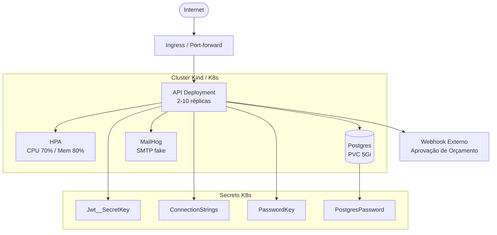

# Oficina Mecânica — API (Fase 2)

API REST desenvolvida em **ASP.NET Core (.NET 10)** como Tech Challenge da pós-graduação FIAP SOAT.
Gerencia o ciclo completo de uma oficina mecânica: clientes, veículos, serviços, peças, ordens de serviço e autenticação por perfil.

> Este README é uma adaptação do [`README.md`](./README.md) original com o fluxo de Kubernetes/HPA e Terraform **validado passo a passo de ponta a ponta** em ambiente Windows. Use-o como guia operacional da Fase 2; para a visão de arquitetura/domínio, o `README.md` continua sendo a referência principal.

---

## Índice

- [Arquitetura](#arquitetura)
- [Pré-requisitos](#pré-requisitos)
- [Instalando Kind e Terraform no Windows](#instalando-kind-e-terraform-no-windows)
- [Como executar (Docker Compose)](#como-executar-docker-compose)
- [Kubernetes — fluxo manual validado (sem Terraform)](#kubernetes--fluxo-manual-validado-sem-terraform)
- [Terraform (IaC) — corrigido e validado](#terraform-iac--corrigido-e-validado)
- [HPA — testando o autoscaling de ponta a ponta](#hpa--testando-o-autoscaling-de-ponta-a-ponta)
- [Troubleshooting (achados desta sessão)](#troubleshooting-achados-desta-sessão)
- [CI/CD](#cicd)
- [Documentação interativa (Scalar)](#documentação-interativa-scalar)
- [Autenticação](#autenticação)
- [Cobertura de testes](#cobertura-de-testes)
- [Relatório de vulnerabilidades](#relatório-de-vulnerabilidades)

---

## Arquitetura

Clean Architecture, quatro camadas, dependências sempre apontando para dentro:

```
API  →  Application  →  Domain
 ↓           ↓
Infrastructure
```



> Detalhes de camadas, Value Objects e Domain Events: ver [`README.md`](./README.md#arquitetura).

---

## Pré-requisitos

| Ferramenta | Versão mínima | Observação |
|---|---|---|
| .NET SDK | 10.0 | |
| Docker Desktop | 24+ | **o engine precisa estar rodando** (não basta o CLI instalado) — sem isso `kind create cluster` falha com erro de pipe |
| kubectl | 1.28+ | |
| Kind | 0.20+ | testado com `v0.31.0` |
| Terraform | 1.6+ | testado com `v1.15.6` — ver [seção de status conhecido](#terraform-iac--status-conhecido) |

---

## Instalando Kind e Terraform no Windows

Via **Chocolatey** (em PowerShell como Administrador):

```powershell
choco install kind terraform -y
```

Ou via **winget**:

```powershell
winget install Kubernetes.kind
winget install Hashicorp.Terraform
```

Confirme:

```powershell
kind version
terraform version
docker info   # confirma que o engine do Docker Desktop está de pé
```

---

## Como executar (Docker Compose)

```bash
docker compose up -d --build
docker compose ps
docker logs -f oficina_api
```

API em `http://localhost:5000`, MailHog em `http://localhost:8025`.

---

## Kubernetes — fluxo manual validado (sem Terraform)

Este caminho 100% manual também foi testado de ponta a ponta nesta sessão. Use-o para entender o que acontece "por baixo" do Terraform, para debugar passo a passo, ou em uma máquina sem Terraform disponível. Para o dia a dia, prefira a [seção Terraform](#terraform-iac--corrigido-e-validado) — ela automatiza exatamente estes mesmos passos.

### 1. Criar o cluster Kind

```powershell
kind create cluster --name oficina-mecanica
```

> Se aparecer `x509: certificate signed by unknown authority` em comandos `kubectl` subsequentes, é um problema cosmético de verificação de certificado no Windows — a conectividade real funciona. Contorne com:
> ```powershell
> kubectl config set-cluster kind-oficina-mecanica --insecure-skip-tls-verify=true
> ```

### 2. Build da imagem da API e carga no cluster (sem registry)

```powershell
docker build -t oficina-mecanica-api:local .
kind load docker-image oficina-mecanica-api:local --name oficina-mecanica
```

### 3. Editar `k8s/secret.yaml` com credenciais reais

O secret tem **4 chaves** (a 4ª foi adicionada para corrigir um bug — ver [Troubleshooting](#troubleshooting-achados-desta-sessão)):

```yaml
stringData:
  Jwt__SecretKey: "<sua-chave-com-32-chars>"
  Seguranca__PasswordKey: "<sua-chave>"
  PostgresPassword: "<sua-senha>"
  ConnectionStrings__DefaultConnection: "Host=postgres;Port=5432;Database=OficinaDB;Username=postgres;Password=<sua-senha-igual-a-de-cima>"
```

> `PostgresPassword` e a senha embutida em `ConnectionStrings__DefaultConnection` **precisam ser idênticas** — uma alimenta o `POSTGRES_PASSWORD` do container do banco, a outra a string de conexão da API.

### 4. Aplicar os manifests, na ordem de dependência

```powershell
kubectl apply -f k8s/secret.yaml
kubectl apply -f k8s/configmap.yaml
kubectl apply -f k8s/postgres-pvc.yaml
kubectl apply -f k8s/postgres-deployment.yaml
kubectl apply -f k8s/postgres-service.yaml
kubectl rollout status deployment/postgres --timeout=120s

kubectl apply -f k8s/mailhog-deployment.yaml
```

Para a API, como a imagem é local (não veio de um registry), o deployment precisa apontar para `oficina-mecanica-api:local` em vez do placeholder. Gere uma cópia local do manifest (sem alterar o arquivo versionado):

```bash
sed 's/IMAGE_TAG_PLACEHOLDER/oficina-mecanica-api:local/; \
     /image: oficina-mecanica-api:local/a\          imagePullPolicy: Never' \
  k8s/api-deployment.yaml > /tmp/api-deployment-local.yaml

kubectl apply -f /tmp/api-deployment-local.yaml
kubectl apply -f k8s/api-service.yaml
kubectl apply -f k8s/api-hpa.yaml
```

> Em ambiente real (CI/CD via GHCR, ou EKS), use `k8s/api-deployment.yaml` direto — o pipeline em `.github/workflows/ci.yml` já faz esse `sed` substituindo pela tag real da imagem publicada.

### 5. Instalar o metrics-server (obrigatório para o HPA funcionar)

Kind **não vem com metrics-server**. Sem ele, `kubectl get hpa` fica eternamente em `TARGETS: <unknown>/70%` e nunca escala.

```powershell
kubectl apply -f https://github.com/kubernetes-sigs/metrics-server/releases/latest/download/components.yaml

# Em clusters Kind/local o kubelet usa certificado self-signed — necessário permitir TLS inseguro:
kubectl patch deployment metrics-server -n kube-system --type='json' `
  -p='[{"op":"add","path":"/spec/template/spec/containers/0/args/-","value":"--kubelet-insecure-tls"}]'

kubectl rollout status deployment/metrics-server -n kube-system --timeout=90s
```

Confirme que as métricas chegam (pode levar ~30-60s):

```powershell
kubectl top pods
kubectl get hpa
# TARGETS deve mostrar números reais, ex: cpu: 1%/70%, memory: 23%/80%
```

### 6. Acessar a API e o MailHog

```powershell
kubectl port-forward svc/oficina-mecanica-api 5000:80
# http://localhost:5000/scalar
# http://localhost:5000/health  -> "Healthy"
```

```powershell
kubectl port-forward svc/mailhog 8025:8025
# http://localhost:8025
```

> Se `/health` retornar `404` via port-forward mas a API estiver `1/1 Running`, é provável que outra coisa já esteja escutando na porta local 5000 (`netstat -ano | findstr :5000`). Use outra porta local: `kubectl port-forward svc/oficina-mecanica-api 5050:80`.

> ⚠️ Nunca commite `k8s/secret.yaml` com valores reais. Adicione-o ao `.gitignore`.

---

## Terraform (IaC) — corrigido e validado

O Terraform em `infra/local/` provisiona o cluster Kind, carrega a imagem da API, instala o metrics-server e aplica todos os manifests Kubernetes automaticamente — **validado com `terraform init → plan → apply → destroy` rodando do início ao fim nesta sessão.**

### O que foi corrigido

`infra/local/main.tf` usava os providers de comunidade `tehcyx/kind` (v0.11.0) e `gavinbunney/kubectl` (v1.19.0), abandonados desde ~2021. Eles foram **removidos**. O módulo agora usa só os providers oficiais `hashicorp/null` e `hashicorp/local`, chamando os binários `kind` e `kubectl` diretamente via `local-exec` — mesmo resultado, sem depender de plugin não mantido. Arquivos novos/alterados: `main.tf`, `variables.tf`, `outputs.tf`, `kind-config.yaml`.

### Pré-requisito crítico no Windows: antivírus com inspeção HTTPS

Mesmo depois de trocar os providers, o `terraform init`/`apply` continuava falhando — **com qualquer provider, inclusive os oficiais da HashiCorp** — com:

```
Plugin did not respond... transport: authentication handshake failed:
tls: failed to verify certificate: x509: certificate signed by unknown authority
```

A causa raiz não era o código do Terraform: era o **AVG Antivirus** (Web Shield) interceptando TLS até em conexões loopback (`127.0.0.1`), que é onde o Terraform troca dados com os plugins via mTLS. Qualquer antivírus com "inspeção de tráfego HTTPS/Web Shield" (AVG, Avast, Kaspersky, ESET, etc.) pode causar o mesmo problema.

**Correção:** desative a inspeção HTTPS/Web Shield do antivírus antes de rodar comandos Terraform (normalmente em Configurações → Proteção de Componentes → Proteção Web). Depois de desativado, `terraform plan`/`apply` funcionaram imediatamente, inclusive com os providers oficiais.

### Como usar

```bash
# 1. Build da imagem da API — feito FORA do Terraform.
#    (no Windows, chamar "docker build" como filho do processo terraform.exe
#    cancela a transferência do build context com "context canceled" — uma
#    interação específica do gerenciamento de processos do Terraform nesse SO,
#    não reproduzida ao buildar via PowerShell/Bash direto. Por isso o build
#    é um passo manual antes do apply, e o Terraform só faz o "kind load".)
docker build -t oficina-mecanica-api:local .

# 2. Editar k8s/secret.yaml com credenciais reais
#    (Jwt__SecretKey, Seguranca__PasswordKey, PostgresPassword e
#    ConnectionStrings__DefaultConnection — as duas últimas com a mesma senha)

# 3. Inicializar e aplicar
cd infra/local
terraform init
terraform plan
terraform apply -auto-approve

# 4. Ver outputs e verificar o cluster
terraform output
kubectl --context kind-oficina-mecanica get pods
kubectl --context kind-oficina-mecanica get hpa

# 5. Destruir o ambiente (remove o cluster Kind por completo)
terraform destroy -auto-approve
```

### Variáveis disponíveis (`infra/local/variables.tf`)

| Variável | Default | Descrição |
|---|---|---|
| `cluster_name` | `oficina-mecanica` | Nome do cluster Kind |
| `load_local_image` | `true` | Se `true`, espera uma imagem local (`docker build` prévio) e faz `kind load docker-image`. Se `false`, assume que `api_image` já está em um registry acessível pelo cluster |
| `api_image` | `oficina-mecanica-api:local` | Tag da imagem usada no Deployment |

Para usar uma imagem de um registry real (ex. produção/CI), publique a imagem e rode:
```bash
terraform apply -var="load_local_image=false" -var="api_image=ghcr.io/<usuario>/oficina-mecanica-api:sha-abc123"
```

### Resultado observado nesta sessão

```
Apply complete! Resources: 13 added, 0 changed, 0 destroyed.

Outputs:
cluster_name         = "oficina-mecanica"
kubeconfig_context   = "kind-oficina-mecanica"
port_forward_api     = "kubectl --context kind-oficina-mecanica port-forward svc/oficina-mecanica-api 5000:80"
port_forward_mailhog = "kubectl --context kind-oficina-mecanica port-forward svc/mailhog 8025:8025"
```

```
kubectl --context kind-oficina-mecanica get hpa
NAME                       REFERENCE                         TARGETS                        MINPODS   MAXPODS   REPLICAS   AGE
oficina-mecanica-api-hpa   Deployment/oficina-mecanica-api   cpu: 1%/70%, memory: 23%/80%   2         10        2          90s
```

`terraform destroy -auto-approve` removeu os 13 recursos e apagou o cluster Kind por completo.

---

## HPA — testando o autoscaling de ponta a ponta

Com o metrics-server instalado (passo 5 acima), o teste segue o roteiro de [`FASE2_COMPLIANCE.md`](./FASE2_COMPLIANCE.md), Cena 5:

**Terminal 1 — observar o HPA:**
```bash
kubectl get hpa -w
```

**Terminal 2 — gerar carga.** Um único `wget` em loop sequencial **não é suficiente** para passar de 70% de CPU (request da API é só `250m`); use 3–4 pods em paralelo:

```bash
for i in 1 2 3 4; do
  kubectl run load-test-$i --image=busybox --restart=Never -- \
    sh -c "while true; do wget -q -O- http://oficina-mecanica-api/health; done"
done
```

Resultado observado nesta sessão: CPU subiu de ~1% para 58–60%, depois **escalou de 2 para 7 réplicas**.

**Para parar a carga e ver o scale-down:**
```bash
kubectl delete pod load-test-1 load-test-2 load-test-3 load-test-4 --force --grace-period=0
```

O HPA tem uma janela de estabilização padrão de **~5 minutos** antes de reduzir réplicas (evita flapping) — não é instantâneo. Nesta sessão, após a carga cessar, as réplicas caíram de 7 → 3 → 2 ao longo de ~5-7 minutos, terminando exatamente no mínimo configurado.

```bash
kubectl get all
kubectl describe hpa oficina-mecanica-api-hpa
```

---

## Troubleshooting (achados desta sessão)

| Sintoma | Causa | Correção |
|---|---|---|
| `password authentication failed for user "postgres"` em loop na API | `k8s/postgres-deployment.yaml` lia `POSTGRES_PASSWORD` a partir da chave `ConnectionStrings__DefaultConnection` inteira (a connection string completa), não só a senha | Chave dedicada `PostgresPassword` no secret, referenciada separadamente no deployment do Postgres |
| `kubectl get hpa` mostra `TARGETS: <unknown>/70%` para sempre | metrics-server não instalado (Kind não vem com ele) | Instalar `metrics-server` com `--kubelet-insecure-tls` (passo 5 acima) |
| `x509: certificate signed by unknown authority` em qualquer comando `kubectl` | Bug de verificação de certificado do client Go no Windows com clusters Kind | `kubectl config set-cluster <nome> --insecure-skip-tls-verify=true` |
| `terraform apply` falha com `Plugin did not respond` / handshake TLS, **mesmo com providers oficiais da HashiCorp** | Antivírus com inspeção HTTPS (AVG, Avast, Kaspersky, etc.) interceptando TLS em loopback (127.0.0.1), onde o Terraform fala com os plugins via mTLS | Desativar o Web Shield / inspeção HTTPS do antivírus antes de rodar comandos Terraform |
| `terraform apply` antigo falhava nos providers `tehcyx/kind`/`gavinbunney/kubectl` | Providers de comunidade abandonados desde 2021, incompatíveis com Terraform recente | Removidos — `infra/local/main.tf` agora usa só `hashicorp/null`/`hashicorp/local` com `local-exec` chamando `kind`/`kubectl` direto |
| `docker build` dentro do `local-exec` do Terraform falha com `error from sender: context canceled` | Interação específica do Windows entre o gerenciamento de processos do `terraform.exe` e o streaming do buildx — não ocorre buildando via PowerShell/Bash direto | Build feito fora do Terraform (passo manual); o Terraform só roda `kind load docker-image` de uma imagem já existente |
| `/health` retorna `404` via `kubectl port-forward`, mas pod está `1/1 Running` | Outro processo já escutando na porta local escolhida (ex. 5000) | Usar outra porta local no `port-forward` |
| `kind create cluster` falha com erro de pipe do Docker | Docker Desktop instalado mas o engine não está rodando | Abrir o Docker Desktop e aguardar `docker info` responder antes de criar o cluster |
| CPU do HPA não passa de ~58% mesmo sob carga | Um único pod `busybox` com `wget` sequencial gera pouca carga | Rodar 3+ pods de carga em paralelo |
| API reinicia uma vez no boot com `duplicate key value violates unique constraint "PK___EFMigrationsHistory"` | Race benigna: as 2 réplicas do Deployment chamam `Database.Migrate()` simultaneamente no startup, uma delas perde a corrida | Não é um bug introduzido por esta sessão; o pod se recupera sozinho no restart seguinte |

---

## CI/CD

Pipeline em `.github/workflows/ci.yml`:

- **Pull Request:** `build-and-test` (restore + build + test)
- **Push em `main`:** `build-and-test → build-docker → deploy-banco → deploy-api`

A imagem publicada (`ghcr.io/<usuario>/oficina-mecanica-api`) já resolve o problema do placeholder de imagem via `sed` no próprio workflow — o fluxo manual local descrito aqui é só necessário quando não há acesso a esse registry.

---

## Documentação interativa (Scalar)

```
http://localhost:5000/scalar
```

Collection Postman completa em [`docs/oficina-mecanica.postman_collection.json`](docs/oficina-mecanica.postman_collection.json).

---

## Autenticação

JWT Bearer Token, obtido via `POST /Auth/login`. Perfis: `Admin` (0), `Mecanico` (1), `Cliente` (2). Token expira em 5 minutos.

> Detalhes completos de rotas públicas/protegidas por perfil: ver [`README.md`](./README.md#autenticação).

---

## Cobertura de testes

476 testes (392 unitários + 84 de integração), 90.5% de cobertura de linhas no total.

> Como gerar o relatório localmente: ver [`README.md`](./README.md#cobertura-de-testes).

---

## Relatório de vulnerabilidades

Documentado em [`relatorio-vulnerabilidades.md`](./relatorio-vulnerabilidades.md) — 10 achados mapeados contra OWASP Top 10.
