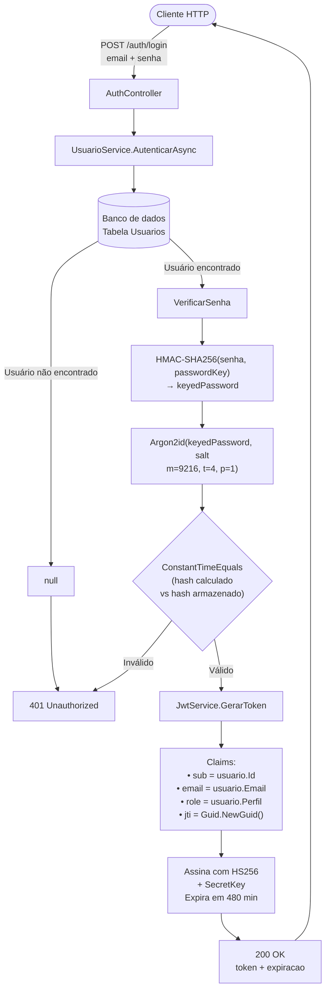
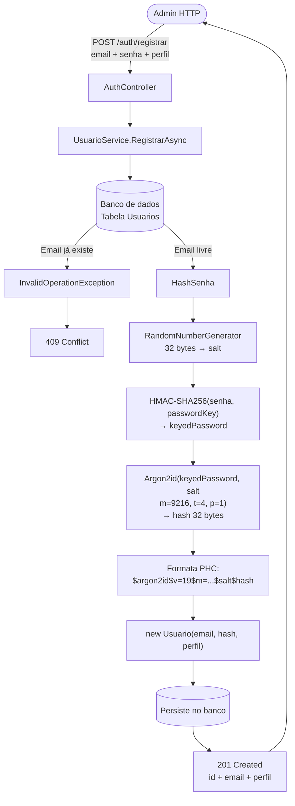
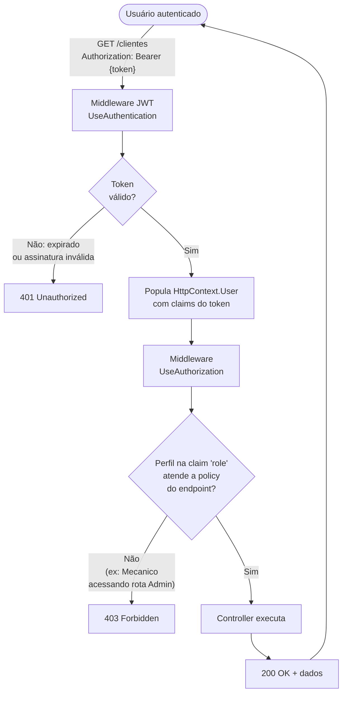

# ADR-001 — Autenticação JWT com Argon2id

| Campo        | Valor                          |
|--------------|-------------------------------|
| **Status**   | Aceito                         |
| **Data**     | 2026-04-18                     |
| **Autores**  | Time M4                        |
| **Contexto** | Fase 1 — Tech Challenge FIAP   |

---

## Contexto

O sistema de oficina mecânica necessita de um mecanismo de autenticação para proteger as rotas administrativas (gestão de clientes, veículos, ordens de serviço) e permitir que mecânicos e administradores operem o sistema com segurança. Clientes da oficina **não autenticam** nesta fase: eles consultam o status de suas OS via endpoint público.

---

## Decisão

Adotar **JWT (JSON Web Token)** com **HS256** para autenticação stateless, combinado com **Argon2id + HMAC-SHA256** para hash de senhas.

---

## Consequências

**Positivas:**
- Stateless: sem sessão no servidor, escala horizontalmente
- Perfil (`Admin`, `Mecanico`) embutido no token como claim `role`, eliminando consulta ao banco por requisição
- Argon2id é resistente a ataques de GPU/ASIC, superior ao BCrypt para hardware moderno
- HMAC-SHA256 na senha antes do Argon2id adiciona defesa contra vazamento de banco (pepper)

**Negativas/Trade-offs:**
- Tokens não podem ser revogados antes da expiração sem infraestrutura adicional (blacklist/Redis)
- A `SecretKey` precisa ser rotacionada fora de banda: todos os tokens em circulação são invalidados na rotação

---

## Alternativas consideradas

| Alternativa | Motivo de rejeição |
|---|---|
| BCrypt | Vulnerável a ataques de GPU modernos; Argon2id é o padrão recomendado pelo OWASP desde 2023 |
| HMAC-SHA256 puro | Não é um KDF: não tem fator de custo adaptável; descartado conforme revisão de segurança |

---

## Parâmetros de configuração

```json
"Jwt": {
  "SecretKey": "<mínimo 32 caracteres, variável de ambiente em produção>",
  "Issuer":    "mecanica-api",
  "Audience":  "mecanica-cliente",
  "ExpiracaoMinutos": 480
}
```

```json
"Seguranca": {
  "PasswordKey": "<pepper, variável de ambiente em produção>"
}
```

**Argon2id:** `m=9216` (9 MiB), `t=4` iterações, `p=1` thread, hash 32 bytes  
**Formato do hash armazenado:** `$argon2id$v=19$m=9216,t=4,p=1$<salt_b64>$<hash_b64>`

---

## Fluxo de autenticação

### Login



### Registro de usuário (uso interno)



### Acesso a rota protegida



---

## Âncora para autenticação futura de clientes

A entidade `Usuario` possui `ClienteId (Guid?)` e o enum `Perfil` inclui `Cliente = 2`. Quando o portal do cliente for implementado:

1. Um `Usuario` com `Perfil.Cliente` será criado e vinculado ao `Cliente` pelo `ClienteId`
2. `JwtService.GerarToken` emitirá a claim `clienteId` quando `ClienteId.HasValue`
3. Rotas do portal usarão `[Authorize(Policy = Policies.Cliente)]`

Não haverá migration adicional: a estrutura já existe.

---

## Arquivos relevantes

| Arquivo | Responsabilidade |
|---|---|
| `src/OficinaMecanica.Domain/Entities/Usuario.cs` | Entidade de domínio |
| `src/OficinaMecanica.Domain/Enums/Perfil.cs` | Enum de perfis (`Admin=0`, `Mecanico=1`, `Cliente=2`) |
| `src/OficinaMecanica.Application/Services/UsuarioService.cs` | Hash Argon2id + autenticação |
| `src/OficinaMecanica.Application/Services/JwtService.cs` | Geração do token JWT |
| `src/OficinaMecanica.Application/AuthorizationPolicies.cs` | Constantes de políticas |
| `src/OficinaMecanica.API/Controllers/AuthController.cs` | Endpoints `/auth/login` e `/auth/registrar` |
| `src/OficinaMecanica.API/Program.cs` | Configuração JWT + políticas de autorização |
| `src/OficinaMecanica.Infrastructure/Migrations/` | Schema do banco incluindo `Usuarios.ClienteId` |
