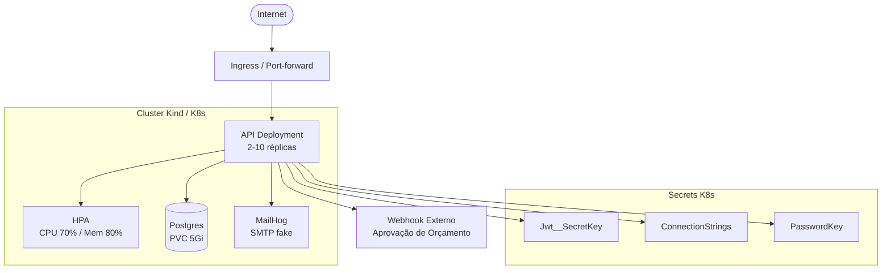

# ADR-003 — Desenho da Infraestrutura (Fase 2)

| Campo        | Valor                          |
|--------------|-------------------------------|
| **Status**   | Aceito                         |
| **Data**     | 2026-06-29                     |
| **Autores**  | Rafael                      |
| **Contexto** | Fase 2 — Tech Challenge FIAP   |

---

## Contexto

Na Fase 2 do Tech Challenge, o requisito passou a exigir execução da API em ambiente Kubernetes com suporte a escalabilidade automática, segredos gerenciados pelo cluster e serviços auxiliares (banco de dados e e-mail) rodando como workloads dentro do mesmo cluster. O ambiente local utiliza Kind (Kubernetes in Docker) para simular o cluster, e Terraform para provisionar a infraestrutura como código.

O diagrama abaixo descreve o desenho adotado:

---

## Decisões

### 1. Kubernetes como plataforma de execução

**Decisão:** executar a API como `Deployment` no Kubernetes (cluster Kind para desenvolvimento local).

**Motivo:** o requisito da Fase 2 exige orquestração de contêineres com suporte a múltiplas réplicas e auto-scaling, eliminando dependência de `docker-compose` para execução principal.

**Consequências:**
- A imagem Docker já existente é reutilizada sem alteração.
- O ponto de entrada passa a ser gerenciado pelo Kubernetes (liveness/readiness probes, restart policies).
- Necessidade de manifests YAML em `k8s/`.

---

### 2. Horizontal Pod Autoscaler (HPA)

**Decisão:** configurar HPA com limites de 2 réplicas mínimas e 10 máximas, acionado por CPU ≥ 70% ou memória ≥ 80%.

**Motivo:** garantir disponibilidade sob carga variável sem provisionar capacidade ociosa fixa, e atender ao requisito de escalabilidade automática da Fase 2.

**Consequências:**
- As replicas iniciais são 2 (alta disponibilidade mínima).
- O Metrics Server deve estar habilitado no cluster Kind.
- Requests/Limits de CPU e memória precisam estar definidos no Deployment para que o HPA funcione corretamente.

---

### 3. PostgreSQL como StatefulSet com PersistentVolumeClaim

**Decisão:** rodar o PostgreSQL dentro do cluster Kubernetes com um PVC de 5 Gi para persistência dos dados.

**Motivo:** manter a paridade de ambiente com Docker Compose e evitar dependência de banco externo (RDS, Cloud SQL) para o ambiente de desenvolvimento/avaliação da Fase 2.

**Consequências:**
- Dados sobrevivem a reinicializações do Pod.
- Não há replicação de banco neste desenho (aceitável para o escopo do Tech Challenge).
- Em produção real, recomenda-se migrar para banco gerenciado.

---

### 4. MailHog como serviço SMTP fake dentro do cluster

**Decisão:** rodar MailHog como Deployment interno para capturar e-mails disparados pelos Domain Events (`OrcamentoEnviadoEvent`, `OrdemConcluidaEvent`, etc.).

**Motivo:** evitar dependência de servidor SMTP externo e permitir inspeção visual dos e-mails durante avaliação, sem custo ou configuração adicional.

**Consequências:**
- A variável `Email__SmtpHost` aponta para o Service interno do MailHog.
- Nenhum e-mail é efetivamente entregue ao destinatário real.

---

### 5. Segredos gerenciados como Kubernetes Secrets

**Decisão:** armazenar `Jwt__SecretKey`, `ConnectionStrings__DefaultConnection` e `PasswordKey` como Kubernetes Secrets, injetados como variáveis de ambiente no Pod da API.

**Motivo:** evitar credenciais em texto plano em ConfigMaps, imagens Docker ou repositório de código, seguindo o princípio de menor privilégio.

**Consequências:**
- Os segredos são criados manualmente (ou via Terraform) antes do deploy.
- Em pipelines CI/CD, os valores são armazenados como GitHub Actions Secrets e aplicados via `kubectl apply`.
- Rotação de segredos requer `kubectl rollout restart` para que os novos valores sejam carregados pelos Pods.

---

### 6. Ingress / Port-forward como ponto de entrada

**Decisão:** expor a API via Ingress (ou port-forward para ambiente local Kind) na porta padrão da aplicação.

**Motivo:** o Kind não possui LoadBalancer nativo; port-forward é a forma mais simples de testar localmente sem instalar MetalLB ou similar.

**Consequências:**
- Em ambientes de nuvem (EKS, GKE, AKS), substituir port-forward por Ingress Controller real (nginx, ALB, etc.).
- A URL da API muda conforme o ambiente, devendo ser parametrizada nas collections de teste.

---

### 7. Terraform para provisionamento da infraestrutura como código (IaC)

**Decisão:** usar Terraform (≥ 1.6) para provisionar recursos de infraestrutura (namespaces, secrets, configurações de cluster).

**Motivo:** garantir reprodutibilidade do ambiente e rastreabilidade de mudanças de infraestrutura via controle de versão.

**Consequências:**
- Os arquivos Terraform residem em `infra/`.
- O estado do Terraform é local por padrão (adequado para o escopo do Tech Challenge); em produção usar backend remoto (S3, GCS).
- Toda alteração de infraestrutura deve ser aplicada via `terraform plan` + `terraform apply`, não manualmente.

---

## Alternativas Consideradas

| Alternativa | Motivo da rejeição |
|---|---|
| Docker Compose como único runtime | Não atende ao requisito de Kubernetes e HPA da Fase 2 |
| Banco de dados gerenciado externo (RDS) | Aumenta custo e complexidade para ambiente de avaliação |
| ConfigMap para segredos | Dados sensíveis não devem ficar em ConfigMaps (sem criptografia em repouso nativa) |
| Helm charts | Overhead desnecessário para o escopo do Tech Challenge; manifests YAML diretos são suficientes |

---

## Referências

- [README.md — Desenho da infraestrutura (Fase 2)](../../README.md#desenho-da-infraestrutura-fase-2)
- [infra/](../../infra/) — manifests Kubernetes e Terraform
- [ADR-001](./ADR-001-autenticacao-jwt.md) — Autenticação JWT
- [ADR-002](./ADR-002-refatoracao-clean-arch.md) — Clean Architecture
