# Arquitetura Fase 3

Diagrama macro dos componentes AWS do projeto e como se conectam. Cobre os quatro repositórios (`oficina-infra-db`, `oficina-infra-k8s`, `oficina-mecanica`, `oficina-lambda-auth`) rodando juntos numa conta AWS Academy Learner Lab, região `us-east-1`.

Este documento reflete o estado real do código nesta data, não só o planejamento original. Onde a implementação diverge do que foi planejado, isso está marcado explicitamente.

## Legenda

- ✅ Implementado e testado de ponta a ponta contra AWS real
- ⏳ Planejado, ainda não implementado

## Diagrama

```mermaid
graph TB
    Cliente(["Cliente<br/>autenticado por CPF"])
    Admin(["Admin / Mecânico<br/>autenticado por email+senha"])

    subgraph AWS["AWS Cloud us-east-1"]
        subgraph Publico["Camada pública ⏳"]
            APIGW["API Gateway HTTP API<br/>⏳ pendente, repo oficina-lambda-auth vazio"]
        end

        subgraph Serverless["Camada serverless ⏳"]
            Lambda["Lambda auth-cpf Node.js<br/>⏳ pendente, repo oficina-lambda-auth vazio"]
        end

        subgraph VPC["VPC 10.0.0.0&#47;16 (2 AZs: us-east-1a/1b) ✅"]
            IGW["Internet Gateway ✅"]
            NAT["NAT Gateway<br/>1x, subnet pública AZ-a ✅"]

            subgraph PubSub["Subnets públicas ✅<br/>10.0.1.0&#47;24 · 10.0.2.0&#47;24"]
                NLB["NLB<br/>criado pelo Service K8s tipo LoadBalancer ✅"]
            end

            subgraph PrivSub["Subnets privadas ✅<br/>10.0.10.0&#47;24 · 10.0.20.0&#47;24"]
                subgraph EKS["EKS Cluster 1.34, 1x node t3.small ✅"]
                    APIPod["Deployment API .NET<br/>imagem ECR: placeholder &lt;ECR_URL&gt; ⏳"]
                    HPA["HPA ✅"]
                    Redis["Redis Deployment<br/>emptyDir, sem PVC ✅"]
                    NRAgent["New Relic DaemonSet<br/>+ agentes (ksm, kubelet, logging) ✅"]
                end
                RDS[("RDS PostgreSQL 15.19<br/>db.t3.micro, Single-AZ<br/>storage_encrypted=true ✅")]
            end
        end

        subgraph Gerenciamento["Camada de gerenciamento ✅"]
            SM["Secrets Manager<br/>db-password, jwt-secret-key ✅<br/>internal-api-key ⏳ não provisionado<br/>newrelic-license-key ⏳ hoje é env var manual"]
            SSM["Parameter Store<br/>endpoints, IDs, SGs ✅"]
        end
    end

    NROne["New Relic One<br/>SaaS externo ✅"]

    Cliente -->|"1: POST /auth/cpf {cpf}"| APIGW
    APIGW -->|"2: invoke"| Lambda
    Lambda -->|"3: lê X-Internal-Api-Key"| SM
    Lambda -->|"4: POST /internal/auth/cpf-verify<br/>header X-Internal-Api-Key"| NLB
    NLB --> APIPod
    APIPod -->|"5: valida ApiKey, busca Cliente+Usuario,<br/>gera JWT (issuer/audience próprios)"| RDS
    APIPod -->|"6: 200 {token} / 404 / 401"| NLB
    NLB -->|"7"| Lambda
    Lambda -->|"8: retorna token"| APIGW
    APIGW -->|"9"| Cliente

    Admin -->|"10: POST /api/ordens-servico<br/>Bearer JWT, Idempotency-Key"| NLB
    NLB -->|"11"| APIPod
    APIPod -->|"12: INSERT/SELECT ordem_servico"| RDS
    APIPod -->|"13: cache idempotência 24h"| Redis

    APIPod -.->|"env vars injetadas via K8s Secret"| SM
    EKS -.->|"lê VPC/subnets/SG do RDS"| SSM
    NRAgent -->|"14: traces, logs, métricas"| NROne
```

## Notas sobre divergências do planejamento original

O plano-05 original desenhava a Lambda `auth-cpf` acessando o RDS diretamente e lendo o `jwt-secret-key` do Secrets Manager para assinar o próprio token. A implementação real na API .NET (`oficina-mecanica`, branch do PR #44) seguiu um desenho diferente e mais simples:

- A API .NET já expõe `POST /internal/auth/cpf-verify` (`InternalAuthController`), protegido por uma API Key própria (`X-Internal-Api-Key`, esquema `ApiKey`, `OwnerName` fixo `"lambda-auth"`), destinado especificamente a ser chamado pela Lambda.
- Quem consulta o `Cliente`/`Usuario` no RDS e gera o JWT é a própria API .NET (`AutenticarPorCpfUseCase`), reaproveitando o `ITokenGenerator` que já existe para o login de Admin/Mecânico.
- A Lambda, quando implementada, não precisa de acesso direto ao RDS nem ao `jwt-secret-key`: só precisa da API Key interna para chamar o endpoint acima. Isso simplifica a rede da Lambda (não precisa necessariamente estar dentro da VPC) e evita duplicar lógica de autenticação em duas linguagens.
- **Pendência real:** o secret `internal-api-key` ainda não existe no Secrets Manager nem é populado pelo `populate-secret.sh`; sem ele configurado, o endpoint `/internal/auth/cpf-verify` sempre retorna 401. Isso precisa ser resolvido junto com a implementação da Lambda.
- A licença do New Relic hoje é passada manualmente via variável de ambiente (`NEW_RELIC_LICENSE_KEY`) no `install-newrelic.sh`, não lida do Secrets Manager como o plano original assumia.

## Componentes ainda não implementados

- `oficina-lambda-auth`: repositório existe mas está vazio (só README, "aguardando bootstrap"). API Gateway e a Lambda `auth-cpf` são pendências reais, sem responsável ativo confirmado no momento deste documento.
- Placeholder `<ECR_URL>` no `Deployment` da API: será substituído quando a imagem real for publicada no ECR.
- Rota de admin (`/api/ordens-servico`) hoje é exposta direto pelo NLB. Não está definido se ela também vai passar por um API Gateway com VPC Link no futuro.
