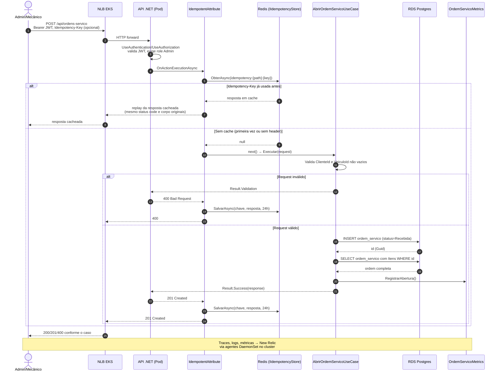

# Diagrama de sequência — Abertura de Ordem de Serviço

Reflete o fluxo real implementado em `OrdemServicosController.Create` → `AbrirOrdemServicoUseCase` (branch do PR #44). Diferente do que o plano-05 original assumia, esta versão **não** dispara Domain Event nem envia email ao abrir a OS; a implementação atual só persiste a ordem e registra uma métrica.

## Diferenças em relação ao plano original

- Não existe `Domain Event Dispatcher` nem `EnviarEmailHandler`/SMTP na abertura de OS hoje; a plano-05 assumia notificação por email nesse fluxo, mas o código atual só persiste e mede.
- A rota não passa por API Gateway hoje (vai direto ao NLB). Se isso mudar no futuro, é decisão pendente de P2 (ver `docs/arquitetura-fase3.md`).
- O `[Idempotent]` também cacheia respostas de erro (ex: 400), não só sucessos. Isso foi levantado como achado de review no PR #44 (uma segunda tentativa com a mesma `Idempotency-Key` depois de corrigir o request continua recebendo o erro antigo em cache por até 24h).

## Pendências

- A infraestrutura de deploy (namespace, Service/NLB, Redis, HPA, ConfigMap) já foi testada de ponta a ponta contra um cluster EKS real (ver `checklist-p3-oficina-infra-k8s.md` no repositório `oficina-infra-k8s`). O fluxo de negócio descrito acima ainda não foi exercitado contra um pod real da API, porque o `Deployment` usa a imagem placeholder `<ECR_URL>` e nunca ficou `Ready`; falta testar de ponta a ponta assim que a imagem real for publicada no ECR.
