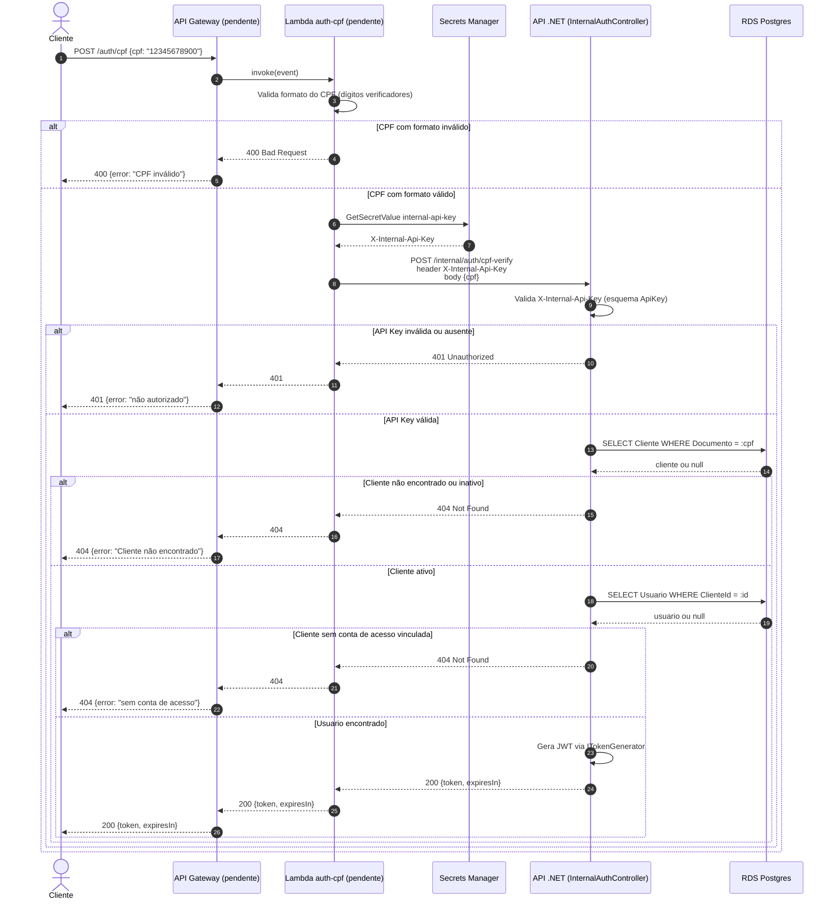

# Diagrama de sequência — Autenticação por CPF

Reflete o desenho real implementado na API .NET (branch do PR #44) mais o fluxo planejado da Lambda, que ainda não existe (`oficina-lambda-auth` está vazio). Os passos 1, 2 e 8, 9 estão marcados como pendentes; os passos 3 a 7 já existem e são testados no `oficina-mecanica` (`AutenticarPorCpfUseCaseTests`, `AuthControllerTests`).

## Diferenças em relação ao plano original

O plano-05 desenhava a Lambda acessando o RDS e o `jwt-secret-key` diretamente. O código real move essa responsabilidade inteira para a API .NET: a Lambda só chama um endpoint interno (`/internal/auth/cpf-verify`) autenticado por API Key própria (não o `jwt-secret-key`), e quem consulta o banco e assina o token é a API. Ver `docs/arquitetura-fase3.md` para o raciocínio completo.

## Pendências

- Implementação da Lambda `auth-cpf` e do API Gateway (`oficina-lambda-auth`, hoje vazio)
- Secret `internal-api-key` no Secrets Manager (ainda não provisionado por nenhum dos repos de infra)
- Validação de formato de CPF na camada da Lambda (hoje só existe validação no `Documento` value object, do lado da API)
